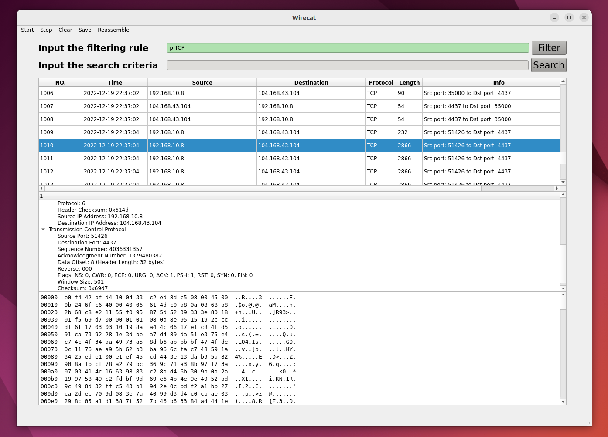

:smile_cat:Wirecat
======

A Not Simple Network Sniffer.



Environment
-----
* Ubuntu 20.04
* Qt 5.9.0
* libpcap 1.10.1

Dependencies
-----
```bash
$ sudo apt-get install qtbase5-dev qtchooser qt5-qmake qtbase5-dev-tools
$ sudo apt-get install libpcap-dev
```

Structure
-----
* `src/` - Source code
  * `src/utils/` - Utility functions
  * `src/utils/utils.h` - Utility functions header
  * `src/utils/utils.cpp` - Utility functions implementation
  * `src/utils/hdr.h` - Package header information
  * `src/main.cpp` - Main function
  * `src/mainwindow.cpp` - Main window
  * `src/mainwindow.h` - Main window header
  * `src/sniffer.cpp` - Sniffer
  * `src/sniffer.h` - Sniffer header
  * `src/catch.h` - Catch package
  * `src/catch.cpp` - Catch package implementation
* `ui/` - UI files
  * `ui/mainwindow.ui` - Main window UI
* `build/` - Build directory
  * `build/build.sh` - Build script
  * `build/sniffer.pro` - Project file
  * `build/bin/` - Executable directory
    * `build/bin/sniffer` - Executable file
* `test/` - Test directory
  * `Makefile` - Makefile
  * `test/test.cpp` - Test file

Build & Run
-----

Use `build.sh` script: 


```bash
# build
$ cd build
$ bash build.sh
# run
$ ./bin/sniffer
```

Manually: 

```bash
# build
$ cd ./build
$ qmake -o Makefile ./sniffer.pro
$ make
# run
$ cd ./bin
$ chmod +x ./sniffer 
$ ./sniffer
```

Test
-----

Test sniffer in terminal: 

```bash
$ cd test
# make clean if necessary
$ make
$ sudo ./test
```

Save to log file: 

```bash
$ cd test
$ mkdir log
# make clean if necessary
$ make
$ echo "eth0" > test.in # change "eth0" to your device
$ sudo ./test < test.in > ./log/"$(date +"%Y-%m-%d_%H-%M-%S").log"
```

TODO
-----
* [x] GUI framework
* [x] Find all network devices
* [x] Catch packets
* [x] Parse packets (Parse IP, TCP, UDP, ICMP, ARP, etc.)
* [x] IP fragmentation reassembly
* [x] Filter packets (Filter IP addresses (src & dst), ports (src & dst), protocols, etc.)
* [x] Search packets (Search by content, etc.)
* [x] Save packets (Save packets to readable file)
* [x] File reassembly (Reassemble files from TCP packets)
* [x] Interact in GUI (Show packets info in GUI)
* [x] Beautify UI (QStyle class may be helpful)

Reference
-----
Resources
* [Getting Started with qmake](https://doc.qt.io/qt-6.2/qmake-tutorial.html)
* [pcap tutorial](https://www.tcpdump.org/pcap.html)
* [sniffex.c](https://www.tcpdump.org/other/sniffex.c)
* [libpcap packet capture tutorial](http://yuba.stanford.edu/~casado/pcap/)
* [Qt groupbox example](https://doc.qt.io/qt-5/qtwidgets-widgets-groupbox-example.html)
* [pcap](https://www.tcpdump.org/manpages/pcap.3pcap.html)

Q&A
* [QGroupBox find selected Radio Button](https://stackoverflow.com/questions/43106746/qgroupbox-find-selected-radio-button)
* [Qt forward declaration problem](https://stackoverflow.com/questions/21113581/qt-invalid-use-of-incomplete-type-and-forward-declaration)
* [Include Qt path in vscode-clangd](https://stackoverflow.com/questions/61206703/is-there-includepath-option-in-clangd#answer-69269142)
